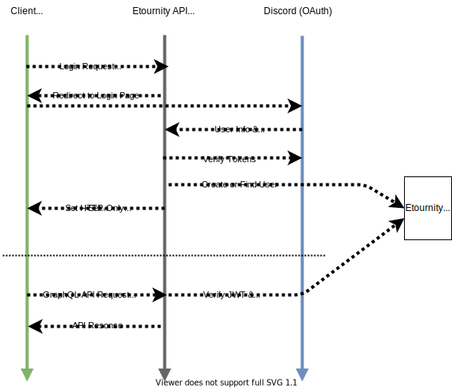

# Security

Our threat model and a list of security issues we have mitigated is available at [etournity/threat-model](https://github.com/etournity/threat-model).

NOTE: Since etournity isn't currently genrerally available, the version available at https://etournity.app might not be 100% up-to-date.
Our staging environment is available at https://dev.etournity.app.

## Tools

We regualy scan etournity for common security issues using the following tools:

- [securityheaders.com](https://securityheaders.com/?q=etournity.app&followRedirects=on) (integrated as a badge in our README)
- [observatory.mozilla.org](https://observatory.mozilla.org/analyze/etournity.app) (integrated as a badge in our README)
- [Qualys SSL Labs](https://www.ssllabs.com/ssltest/analyze.html?viaform=on&d=https%3A%2F%2Fetournity.app)
- [OWASP ZAP Baseline Scan](https://www.zaproxy.org/docs/docker/baseline-scan/)
  Run as part of our CI-Infrastructure, generates a weekly report
- [stackhawk.com](https://stackhawk.com) General & Graphql Security Scanning, currently only being run manually due to limitations with our current github repo structure
- [dependabot.com](https://dependabot.com/) Automated security updates, automatically creates a pull-request if a dependency has a known security vulnerability

## Authentification & JWT tokens

### Current Strategy

### Plans for the future

As of writing, we still plan to implement the following security measures (Most of these aren't relevant yet, since we currently rely on external OAuth providers for authentification):

- Implementing Refresh Tokens\
  Currently, we set a JWT token that is valid for 30 days. As part of the planned email/username & password based authentication, we plan to switch to a refresh token based authentification strategy.
- Password Security\
  Password based login is on our roadmap, however we have already started taking some precautions:
  - A stricter version of our rate-limiting middleware is already inplace and ready to use
  - All passwords will be hashed with [bcrypt](https://www.npmjs.com/package/bcrypt) before being stored in our database
  - We will be blocking previously breached passwords using the [haveibeenpwned.com k-Anonymity API](https://haveibeenpwned.com/API/v3#SearchingPwnedPasswordsByRange)
  - Currently, we plan to use [zxcvbn](https://github.com/dropbox/zxcvbn), an inteligent password strength checker, to require actually secure passwords. This (or possibly another tool) will be used to - instead of meaningless length and symbol requirements - require strong passwords based on their entropy and other factors.
- Email notifications for new logins
- Password resets, following [OWASPs Best Practices](https://cheatsheetseries.owasp.org/cheatsheets/Forgot_Password_Cheat_Sheet.html)
- Two-Factor Authentication
- CodeQL Security Scanning (Currently not possible, since our main repository is not enabled for Github's beta)
- More indepth logs\
  Currently, our logging is very basic. We only log the TTY output of our different processes. Our current roadmap for logging includes:
  - Centralised loging through a [graylog instance](https://www.graylog.org)
  - Logging Security critical actions (like failed logins, tournament creation) and giving access to these logs to both users and organizers
  - Improving our GraphQL login. Currently, errors are logged, however it is hard for us to pinpoint specifics about requests
