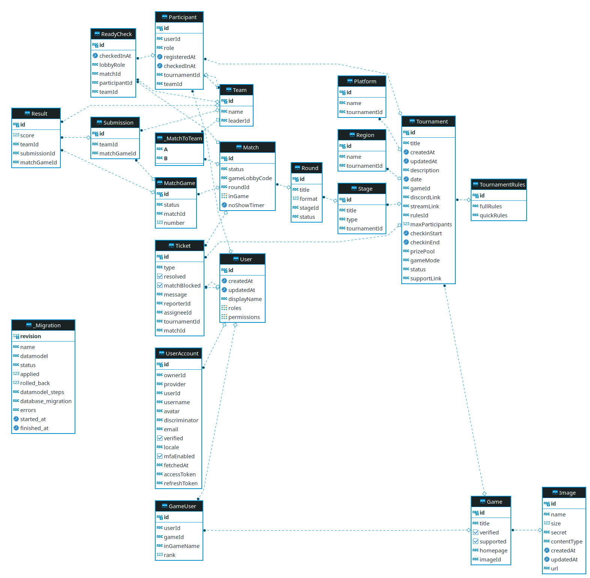

# Database

Etournity is using a [PostgreSQL](https://www.postgresql.org) database with [Prisma](https://prisma.io) as our ORM. This stack allows for typesafe data handling as well as ease of use.

## Contents

- Prisma ORM
- ER-Model
- Environments

## Prisma ORM

An open source ORM created for TypeScript.

### Prisma Schema

This is Prisma's way to define data models. It allows us to define models as easily readable objects and translates those to raw SQL behind the scenes. Read up on the specifics [here](https://www.prisma.io/docs/concepts/components/prisma-schema).

Our Schema as well as migrations are located in `/packages/server/prisma/`.

### Migrations

After changing the schema, create a migration using `yarn migrate:save`.

The changes are automatically applied on server start. To do this manually use `yarn migrate:up`.

> <b>Note:</b> Conventionally, we try to stick to 1 migration per branch. You can easily delete all migrations you made in a branch and do one last migration before merging.

## ER-Model

### Entity Realtion Diagram generated through DBeaver

develop branch @ [8bbde86b7ee29eac9477090e733478ead444f264](https://github.com/JulianKarhof/etournity/commit/8bbde86b7ee29eac9477090e733478ead444f264)

(screenshot taken @ 29.04.2021)

# Environments

## Local

Our local setup is using Docker.

> In order to access the local DB in your Database Tool use the URL from our `/server/.env.example` file.

### Commands

To start a database instance use `yarn postgres:background`.

> <b>Note:</b> The container keeps running until you restart your system.

We have set up automatic seeding for testing, which can be reset through `yarn postgres:reset`.

To stop the container use `yarn postgres:stop-background`.

To delete the container use `yarn postgres:down`.

## Production

Database is hosted on Amazon RDS.

> Snapshots are done daily and saved for the last 7 days.

Security is handled by AWS IAM.

Monitoring is set up on our [Grafana Dashboard](https://etournity.grafana.net/dashboard/snapshot/GyDtLzo8TcQXv9cl2DXqFO0zBRD7SZTC?orgId=1).
